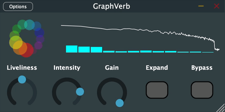

# GraphVerb

**GraphVerb** is a JUCE-based audio plugin that performs dynamic, spectral-aware
reverb processing using graph analysis and K-Means clustering.

---

## How It Works

1. **Spectral Analysis**  
   Uses a short-time Fourier transform (STFT) to extract magnitude information.

2. **Graph Construction**  
   A `SpectralGraph` is built from the spectral bins, treating each bin as a
   node.

3. **Clustering**  
   The graph is clustered via `CommunityClustering` (a simple k-means variant).

4. **Per-Cluster Reverb**  
   Each frequency cluster is passed through a reverb unit with its parameters
   determined by the energy magnitude of that cluster.

5. **Mixing & Output**  
   A weighted sum of wet reverbs (based on normalized cluster energy) is blended
   with the dry signal.

---

## TODO

- [ ] Replace k-means with spectral or graph community detection
- [ ] Host automation support (DAW parameter control)
- [ ] Export as VST3 / AU plugin